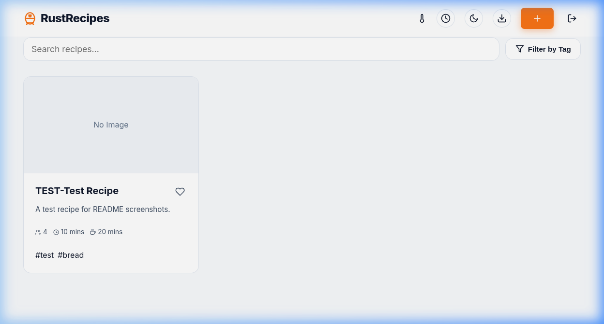
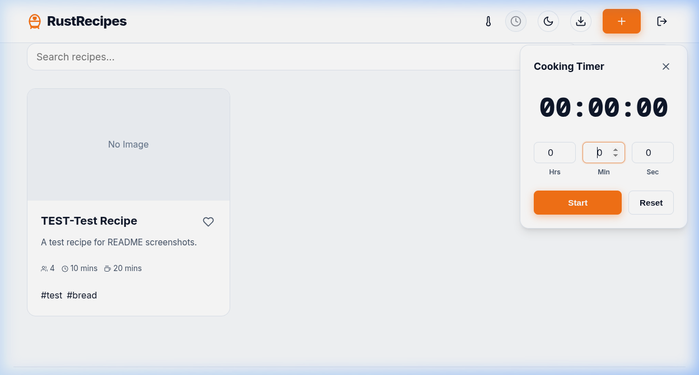
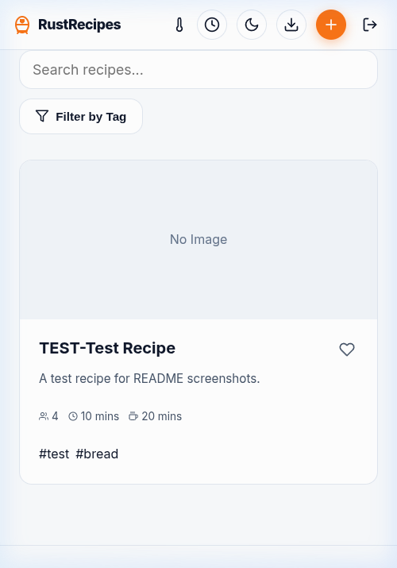
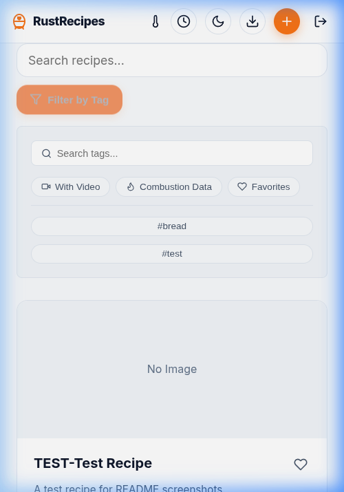

# Rust Recipe Manager

A fast, self-hosted recipe manager built with Rust, Axum, and Askama. Designed for home cooks and BBQ enthusiasts.


## 📸 Preview

<table style="width: 100%; border-collapse: collapse;">
  <tr>
    <td style="width: 50%; vertical-align: top;">
      <strong>Desktop Home</strong><br/>
      
    </td>
    <td style="width: 50%; vertical-align: top;">
      <strong>Integrated Timer</strong><br/>
      
    </td>
  </tr>
  <tr>
    <td style="width: 50%; vertical-align: top;">
      <strong>Mobile Experience</strong><br/>
      
    </td>
    <td style="width: 50%; vertical-align: top;">
      <strong>Smart Filtering (Mobile)</strong><br/>
      
    </td>
  </tr>
</table>

## ✨ Features

- **Mobile-First UI** — Tabbed recipe view, Wake Lock API for cooking, responsive hamburger menu, and card-based admin panel on small screens.
- **Cooking Timer** — Quick-access floating timer with smart suggestions extracted from recipe text, sound/vibration alerts, and browser notifications.
- **Cooking Temperatures & USDA Log 7** — Built-in meat temp reference and an interactive hold-time calculator for safe poultry lethality at lower temps.
- **Multi-Tag Filtering** — Apply multiple tags with AND logic; the filter menu dynamically updates to only show relevant tags.
- **Favorites** — Mark recipes as favorites from cards or detail pages; filter by favorites on the home screen.
- **Ingredient Scaling & Unit Conversion** — Scale yields (0.5x–3x) and convert between Original, Metric, and Imperial inline.
- **Baker's Percentage Mode** — Auto-activates for `bread`/`dough` tagged recipes, showing hydration and ratios relative to flour weight.
- **Combustion Inc. Integration** — Upload thermometer CSV exports to visualize core, surface, and ambient temps with Chart.js.
- **Fermentation Calculator** — Estimates proofing times based on yeast/starter amounts and kitchen temperature.
- **Smart Import** — Scrape recipes from URLs (LD+JSON or Gemini AI fallback), import Paprika archives, or snap a photo of a cookbook page with AI Vision.
- **YouTube Import** — Paste a YouTube URL to generate a recipe from the transcript via Gemini AI, with an embedded player for follow-along.
- **Shopping Lists** — Select multiple recipes, scale portions, and generate a combined ingredient list. Lists are persisted server-side with check-off state and can be cleared.
- **Multi-User & Access Control** — Self-service registration, bcrypt passwords, Google OAuth 2.0, per-user recipe ownership, and public/private visibility toggles.
- **Admin Panel** — Manage users, reset passwords, and delete accounts from a responsive admin interface.
- **REST API** — Full CRUD API (`/api/v1`) with token auth for programmatic access. Built-in interactive API guide at `/api`.

---

## 🔌 API

**Base URL**: `/api/v1` — [Interactive docs at `/api`]

| Endpoint | Method | Description |
| :--- | :--- | :--- |
| `/recipes` | `GET` | List all recipes. |
| `/recipes` | `POST` | Create a recipe. |
| `/recipes/{id}` | `GET` | Get a recipe (supports unit/scale query params). |
| `/recipes/{id}` | `PUT` | Update a recipe. |
| `/recipes/{id}` | `DELETE` | Delete a recipe. |
| `/temps` | `GET` | Internal meat temperature reference. |
| `/log7` | `GET` | USDA Log 7 hold-time calculator. |
| `/ferment` | `GET` | Fermentation time estimator. |
| `/import` | `POST` | Import a recipe from a URL via AI. |
| `/shopping-list` | `POST` | Generate a shopping list from selected recipes. |
| `/shopping-list` | `GET` | Retrieve the saved shopping list. |
| `/shopping-list` | `PUT` | Save/update shopping list state. |
| `/shopping-list` | `DELETE` | Clear the saved shopping list. |

Mutable endpoints require an `API_TOKEN` via `Authorization: Bearer <token>`.

---

## 🔐 Generating an Admin Password Hash

```bash
# With Rust installed locally
cargo run --bin hash_password "my_secure_password"

# Or via Docker
docker run --rm dnewsholme/recipemanager:latest ./hash_password "my_secure_password"
```

Copy the output (e.g., `$2y$12$...`) and use it as `ADMIN_PASSWORD_HASH`.

---

## 🚀 Running Locally

**Environment Variables**:

| Variable | Required | Description |
| :--- | :--- | :--- |
| `ADMIN_EMAIL` | No | Admin email (default: `dbizsley@googlemail.com`). |
| `ADMIN_PASSWORD_HASH` | Yes | Bcrypt hash for admin login. Default password is "admin" if omitted. |
| `API_TOKEN` | Yes | Token for API write access. |
| `SESSION_SECRET` | Recommended | Signs session cookies. Sessions reset on restart if omitted. |
| `GEMINI_API_KEY` | No | Enables AI photo/video/URL import via [Google AI Studio](https://aistudio.google.com/app/apikey). |
| `GOOGLE_CLIENT_ID` | No | Google OAuth 2.0 Client ID. |
| `GOOGLE_CLIENT_SECRET` | No | Google OAuth 2.0 Client Secret. |
| `GOOGLE_REDIRECT_URI` | No | OAuth callback URL (defaults to `<app_base>/login/google/callback`). |
| `APP_BASE` | No | Subpath prefix for reverse proxy setups (e.g., `/recipes`). |

```bash
git clone https://github.com/dnewsholme/recipemanager.git
cd recipemanager
export ADMIN_PASSWORD_HASH='<your_generated_hash>'
export API_TOKEN='your_api_token_here'
export SESSION_SECRET='your_random_secret_string'
cargo run
```

Available at `http://localhost:3000`.

---

## 🐳 Docker

```bash
docker run -d \
  --name recipemanager \
  -p 3000:3000 \
  -e ADMIN_PASSWORD_HASH='<your_generated_hash>' \
  -e API_TOKEN='your_api_token_here' \
  -e SESSION_SECRET='your_random_secret_string' \
  -v /path/to/your/data:/app/data \
  dnewsholme/recipemanager:latest
```

### Data Directory (`/app/data`)
- `recipes.db` — SQLite database (users, recipes, meal plans).
- `uploads/` — Cover images and Combustion CSV files.
- `recipes/` — (Legacy) Place old `.md` files here; they'll be auto-migrated on startup.

---